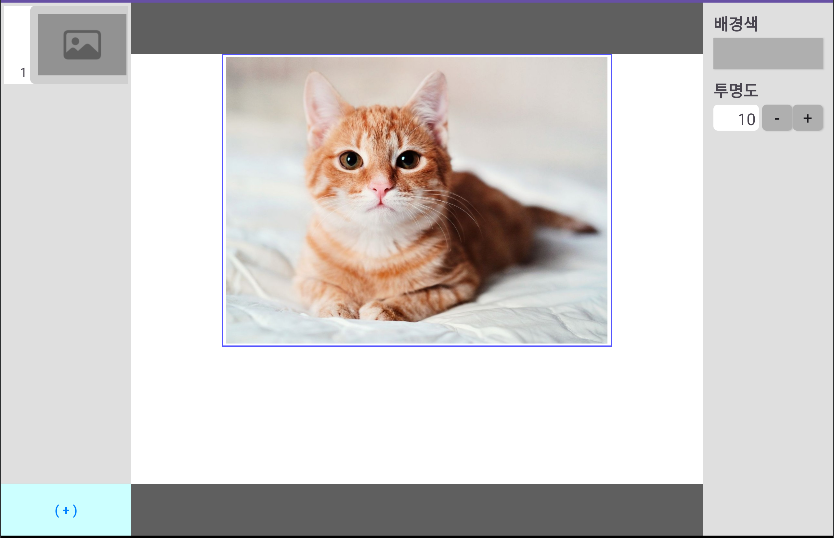
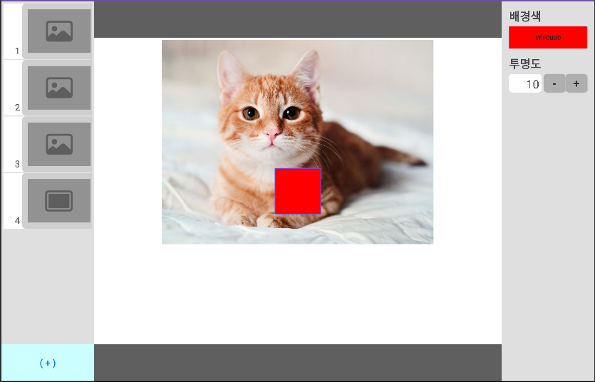

# android-slide
Android 학습 프로젝트 #2

Step 3-1 슬라이드 앱 프로젝트
특정 속성(크기, 색상, 알파값)을 가진 사각형을 출력해낸다.
[출력 결과]

---
Step 3-2/3 속성 변경 동작 / UDF
정사각형인 slide를 클릭시 주변에 클릭했음을 알리는 강조선이 보이고, 배경색 아래에 
있는 버튼을 누를 경우, 버튼 색과 동시에 화면 상의 slide의 색상이 변한다.
또한 투명도를 조절하는 버튼 클릭시 투명도에도 유의미한 변화가 존재한다.
(전체를 100%로 구분해 10%단위로 올리고 내릴 수 있다.)

[출력 결과]

---
Step 3-4 슬라이드 목록 표시
왼쪽에 표시되는 회색 영역에 recycler view를 배치하여 슬라이드를 위한 레이어를 표시한다.
각각의 슬라이드는 드래그를 통해 순서를 변경할 수 있다.
recycler view의 아이템을 클릭시 해당 아이템과 연결된 square slide의 속성을 변경할 수 있게 select된다.

[출력 결과]

---
Step 3-5 사진 슬라이드 추가하기
왼쪽에 표시되는 recycler view의 item을 길게 누르면 팝업 메뉴가 나온다. 
해당 팝업메뉴를 클릭하면 레이어의 제일 앞, 뒤, 그리고 바로 앞, 뒤로 이동이 가능하다.
(슬라이드 순서 변경 방식의 추가)
(+)버튼 클릭시 이미지 혹은 정사각형의 슬라이드가 랜덤으로 출력된다.
이미지 슬라이드의 경우 흰색 view의 중앙 상단에 배치되며, 10dp의 padding이 존재한다.
이미지 슬라이드는 더블클릭으로 디바이스 내의 이미지를 불러올 수 있다.

[출력 결과]

update 2023.07.27 